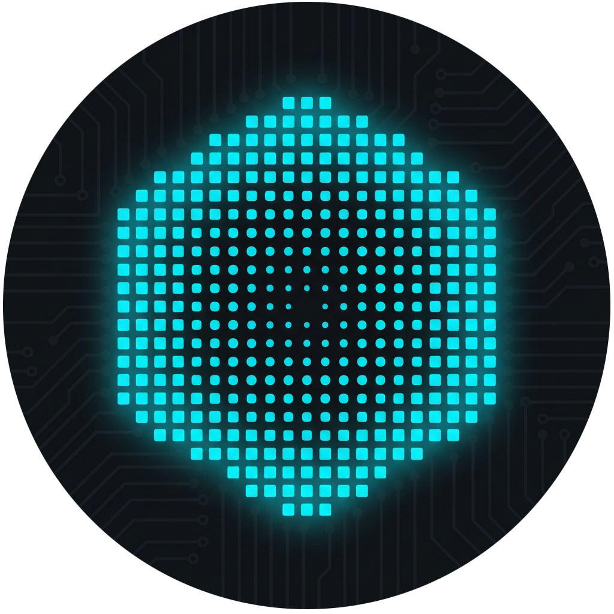

# Image Toolkit Web

A modern web application for advanced image processing, quantitative analysis, and 3D visualization. Built with Next.js and WebGL.



[中文](./README_zh.md) | [日本語](./README_ja.md)

## 🎯 Features

### 📸 Image Processing & Analysis

- **Format Support**: Drag & drop support for PNG, JPG, JPEG, and RAW formats.
- **Grayscale Conversion**: High-precision algorithms for linear normalization and auto-calibration.
- **Region Analysis**: Interactive rectangular selection tools for targeted area analysis.
- **Quantitative Data**: Real-time histogram generation, pixel distribution statistics, and profiling.
- **Data Export**: Export analysis results to CSV or Excel formats for external processing.

### 🎨 Pixel Art & Dither Effects

- **Real-time Dithering**: Apply ordered dithering effects (Bayer, Halftone, Noise, Crosshatch).
- **Color Modes**: Support for Grayscale, Duotone, and Custom Palettes.
- **Animation**: Dynamic grid size breathing effects and animated noise patterns.

### 🔄 Point Cloud & 3D Visualization

- **Data Import**: Reconstruct images from CSV/Excel point cloud data (X, Y, Grayscale).
- **3D Rendering**: Interactive 3D surface visualization using Three.js and React Three Fiber.
- **View Controls**: Adjustable height scaling, color mapping, pulse animation, and auto-rotation.
- **Export**: Download reconstructed 2D images or 3D view snapshots.

## 🚀 Getting Started

### Prerequisites

- Node.js 18+
- npm or yarn

### Installation

```bash
# Clone the repository
git clone https://github.com/yourusername/image-toolkit-web.git

# Navigate to project directory
cd image-toolkit-web

# Install dependencies
npm install
```

### Development

```bash
# Start development server
npm run dev
```

Visit [http://localhost:3000](http://localhost:3000) to view the application.

### Production Build

```bash
# Build for production
npm run build

# Start production server
npm start
```

## 🛠️ Tech Stack

- **Framework**: Next.js 15 (App Router)
- **Language**: TypeScript
- **Styling**: TailwindCSS v4
- **UI Components**: shadcn/ui
- **Icons**: Lucide React
- **Visualization**:
  - Recharts (2D Charts)
  - Three.js + React Three Fiber (3D Rendering)
  - Aceternity UI (Dither Shader)
- **Motion**: Framer Motion
- **Data Processing**: SheetJS (xlsx)

## 📁 Project Structure

```
src/
├── app/                    # App Router pages
│   ├── layout.tsx         # Root layout
│   ├── page.tsx           # Homepage (Landing)
│   ├── image-to-points/   # Image analysis module
│   └── points-to-image/   # Point cloud reconstruction module
├── components/            # React components
│   ├── ui/               # Reusable shadcn/ui components
│   ├── three/            # 3D visualization components
│   ├── dither-shader.tsx # Dither effect component
│   └── navigation.tsx    # Global navigation
├── lib/                  # Utilities and hooks
│   ├── i18n-context.tsx  # Internationalization
│   └── processing.ts     # Image processing algorithms
└── public/               # Static assets
```

## 📊 Data Formats

### Point Cloud Import/Export (CSV)

The application expects or generates CSV files with the following structure:

```csv
X,Y,Grayscale
0,0,128
1,0,255
0,1,64
```

- **X**: Horizontal coordinate (pixel column)
- **Y**: Vertical coordinate (pixel row, bottom-up mathematical coordinates)
- **Grayscale**: Intensity value (0-255)

## 🎨 Key Highlights

- ✅ **Responsive Design**: Optimized for desktop and mobile interactions.
- ✅ **Theme Support**: Seamless Dark/Light mode switching (System default).
- ✅ **Privacy Focused**: All processing happens client-side in the browser.
- ✅ **Internationalization**: Bilingual support (English / Chinese).

## 📝 Usage Workflows

### Image → Point Cloud

1. **Upload**: Select an image file.
2. **Analyze**: Use mouse to draw regions on the canvas.
3. **View Stats**: Check histograms and statistical metrics for selected regions.
4. **Export**: Save the pixel data as a standardized CSV point cloud.

### 3D Visualization

1. **Import**: Upload a valid CSV point cloud file.
2. **Render**: The system automatically reconstructs the 2D image and generates a 3D terrain map.
3. **Interact**: Rotate, zoom, and pan the 3D view. Toggle grid or change render modes.

## 🤝 Contribution

Contributions are welcome! Please feel free to submit a Pull Request.

## � License

This project is licensed under the MIT License - see the LICENSE file for details.
